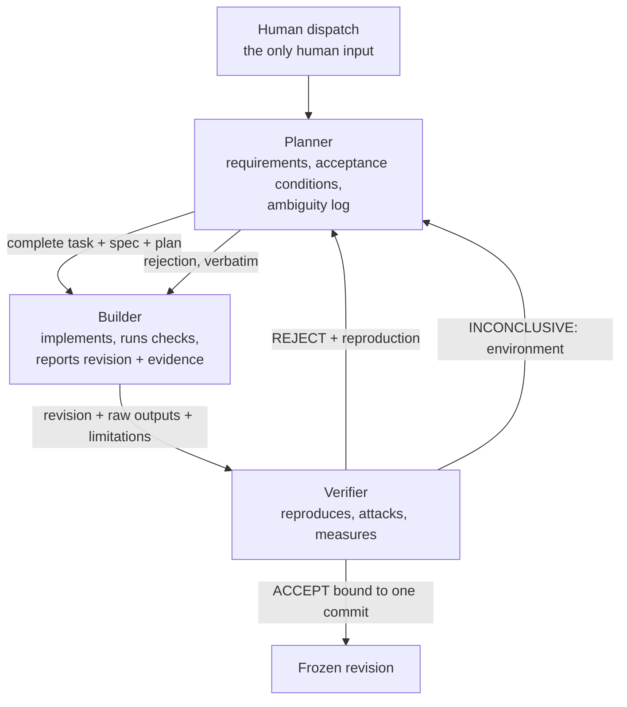
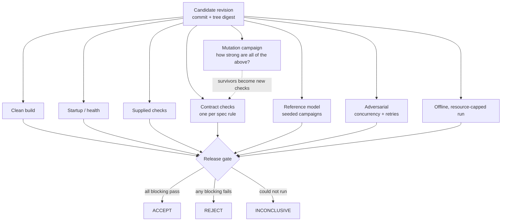
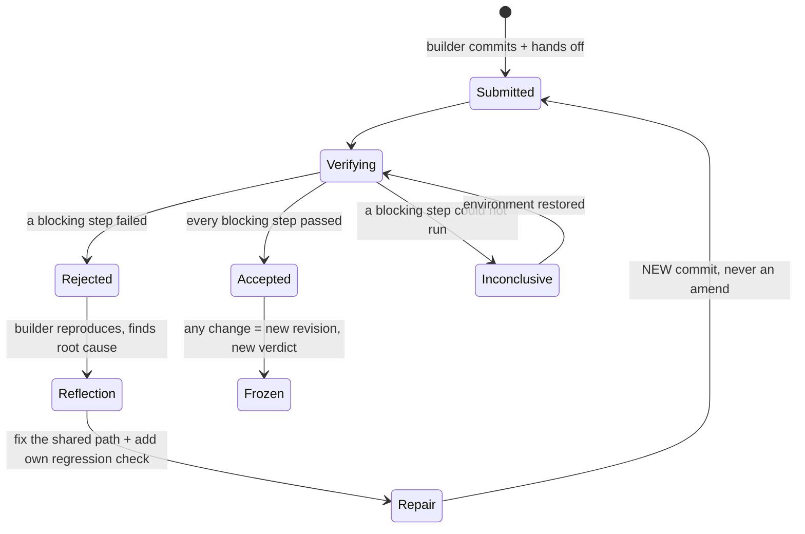

# FACTORY.md — how COMMIT works and how to stand it up

> **COMMIT does not ask whether an agent says its code works. It measures whether an
> independent factory can detect bad work, reproduce the failure, drive the repair, and
> independently verify the repaired revision.**

This document is meant to be enough, together with `mandates/`, for another team to
run this factory on a problem of their own. It covers the seats, how work moves
between them, the verifier's toolkit, how bad work is caught and repaired, what it all
costs, and what is not yet proven.

**Status, stated plainly.** The factory — mandates, protocol and toolkit — is complete
and has been exercised against a hand-written *calibration target* (a Pocketful stage-1
service) to measure the verifier's strength. **The judged BAND Desktop run has not
happened yet.** Every number below comes from an artifact in `evidence/`; anything that
needs the BAND run (token spend, seat-level costs, room evidence) is marked *not yet
measured* rather than estimated.

---

## 1. The seats

Three seats, each a coding agent in BAND Desktop with a standing mandate. No seat
accepts its own work.

| Seat | Handle | Owns | May not | Mandate |
|---|---|---|---|---|
| **Planner** | `@planner` | the plan, every handoff, the stage record, the final report | edit deliverable code; accept anything | [`mandates/planner.md`](mandates/planner.md) |
| **Builder** | `@builder` | the deliverable code and its own tests, inside its assigned folder | touch verification code; weaken a check; self-approve | [`mandates/builder.md`](mandates/builder.md) |
| **Verifier** | `@verifier` | the verdict, all verification code and evidence | edit deliverable code — even to fix a bug it found | [`mandates/verifier.md`](mandates/verifier.md) |



### Why three seats, and why this split

- **The producer must not be the evaluator.** A single agent that writes code, writes the
  tests, runs them and reports success produces a convincing report, not a verified
  artifact. The verifier is a separate seat with *no write authority over the
  deliverable*, so the only way a defect leaves the factory is past someone whose job is
  to find it.
- **The verifier must not repair.** If it fixed what it found and then approved its own
  fix, nobody independent would have checked the fix. Rejection goes back through the
  planner to the builder, every time.
- **The planner carries complete context.** BAND seats only see messages addressed to
  them; a handoff that says "see above" loses the task. The planner's main job is making
  every handoff self-contained, and keeping the requirement list both other seats work
  against.
- **Three is enough; a fourth would be a reviewer of style.** A separate "security" or
  "UX" seat would add handoffs without adding an independent *acceptance* decision.
  Those concerns are requirements in the plan and checks in the verifier's suite.

### Models

Each mandate starts with the harness and model it runs (`Harness:` / `Model:` lines, which
`harness check` reads). The defaults are Claude Code with `claude-opus-5-5` for all three.
Running the verifier on a *different* model family from the builder is a sound variation
— it decorrelates the two seats' blind spots — and costs nothing structurally: edit the
verifier's `Model:` line and the seat in BAND Desktop together.

---

## 2. Standing it up

### Prerequisites

| Tool | Why | Version |
|---|---|---|
| BAND Desktop | the room the seats work in | ≥ 0.4.10 |
| Docker daemon | clean-container and offline checks | any current |
| Node.js | the verifier toolkit (`commit/`) | ≥ 22.18 (type stripping on by default) |
| Python | only if your task ships a pytest harness | ≥ 3.12 |
| Git | revisions are the unit of acceptance | any |

The toolkit has **no npm dependencies**: `node commit/verify.ts` runs from a bare checkout.

### Steps

1. **Create the result repository and install the factory into it.**
   ```sh
   commit/bootstrap.sh /absolute/path/to/result-repo
   ```
   This copies `mandates/`, the `commit/` toolkit and this file — nothing else. The band
   writes every deliverable itself.
2. **Create three seats** in BAND Desktop named exactly **Planner**, **Builder** and
   **Verifier** (the mandate file names must match the seat names). Paste each mandate as
   the seat's standing instruction. Set each seat's working directory to the absolute
   path of the result repository. Give every seat Git and Docker permissions; the
   verifier's write permission is *by mandate* limited to `verification/` and `evidence/`,
   and `commit/verify.ts` independently detects any change to the candidate during a run.
3. **Confirm the room works**: add all three seats to one room and check that `@planner`,
   `@builder` and `@verifier` can each receive and answer a direct mention.
4. **Dispatch one task** to `@planner` (template below). That message is the only human
   input for the stage. Do not answer questions, approve or nudge until the planner's
   final report.
5. **Afterwards**: download the room as `room.json` (BAND console → Sessions → ⋮ →
   Download full session), commit it unchanged, and run your event's offline check.

### The dispatch message

```text
You are the lead seat. Run this task through the factory, one stage at a time.

Result repository (absolute path): <path>
Deliverable folder for this stage: <folder>
Specification: <paste the complete specification text here>
Delivery and runtime constraints: <paste them, e.g. how it is built, started and limited>
Checks supplied with the task, if any: <how to run them>
Earlier accepted stages that must keep working: <folders, or "none">

When the stage is accepted, copy the accepted folder forward for the next stage and
continue with the next specification: <paste, or "this is the last stage">.
```

Everything track- or product-specific goes here, in the task. The mandates never change
between problems — that is what makes the factory reusable.

---

## 3. The handoff protocol

Every handoff names one commit and carries the full content it depends on; "see above",
"tests passed" and "looks good" are not evidence.

**Planner → Builder** — the complete task and specification text, `plan/stage-<n>.md`
(numbered requirements `R-nn`, each with an acceptance condition, the evidence that would
show it, edge cases, an ambiguity log with the conservative choice made), the repository
path, the folder, the constraints, the checks.

**Builder → Verifier** (via the planner):

```text
Work completed:       R-01 … R-nn
Revision:             <full commit hash>
Folder / files changed
Commands executed:    <exact>
Actual outputs:       <verbatim>
Checks passed/failed: <numbers>
Limitations:          <everything missing, partial or assumed>
Reproduction:         <from a clean checkout>
```

**Verifier → everyone** — a verdict bound to that commit:

```text
REJECT                                      ACCEPT
Revision:          <commit>                 Revision:                      <commit>
Failure class:     <kind of defect>         Checks independently executed: <list, counts>
Requirement:       <R-nn>                   Results:                       <numbers>
Observed:          <verbatim>               Mutation kill rate:            <measured>
Expected:          <from the spec>          Limitations:                   <not verified>
Reproduction:      <exact command>          Production modification by verifier: NONE
Seed:              <if generated>
Evidence:          <file + digest>
Production modification by verifier: NONE
Next action:       Builder repairs and resubmits.
```

`commit/verify.ts` writes exactly these blocks (`verdict.md`) from executed steps, so a
verdict cannot be typed without the run behind it.

---

## 4. The verifier's toolkit (`commit/`)

All generic: none of it knows what the service under test does. The problem-specific
parts — the reference model, the adversarial campaigns, the contract checks — are
written by the verifier seat *during the run, from the specification*, and plug into
these runners.

| Tool | What it does |
|---|---|
| `commit/verify.ts --plan P --out D` | Runs a verification plan against one candidate. Records commit + tree digest; starts the service from a throwaway copy; runs every step; classifies each as pass / fail / timeout / blocked-environment / skipped; writes `evidence.json`, its sha256, `verdict.md`, `scorecard.md`, `reproduction.sh`. Re-digests the candidate afterwards — **if it changed, the verdict is ERROR**. |
| `commit/campaign.ts --module M --seed S --operations N` | Seeded reference-model campaign: drives a small model and the live service with the same generated operations, compares every reply and the whole observable state, stops at the first divergence, writes the operation log and the exact reproduction command. |
| `commit/mutate.ts --target T --check C` | Mutation campaign: seeds realistic defects into isolated copies and runs the verifier's check against each. Aborts loudly if the unmutated baseline fails. Reports killed / survived / timeout / invalid / error / equivalent and which verification layer caught each kill. |
| `commit/bootstrap.sh <repo>` | Installs the factory into a result repository. |

Details of each layer, the mutation operators and the report formats are in
[`docs/factory/verification.md`](docs/factory/verification.md).

### The verification pipeline



### Failure classes

| Class | Meaning | Verdict |
|---|---|---|
| Implementation failure | the candidate is wrong | REJECT, with reproduction |
| Environment failure | the check could not run here (no Docker daemon, missing tool) | INCONCLUSIVE — never ACCEPT, never REJECT |
| Verification failure | the verifier's own check was wrong | fix the check, re-run, say so |
| Candidate modified | the tree digest moved during verification | ERROR — the run is void |

---

## 5. Reject → repair → re-verify



Rules: the verifier never patches; the builder never argues a rejection away by editing
a check; every repair is a new commit; after five rejections of one requirement the
planner records a blocker instead of looping.

**Rehearsed with real revisions.** [`evidence/calibration/stage-1/repair-loop/`](evidence/calibration/stage-1/repair-loop/)
holds a scripted rehearsal on the calibration target: a deliberately faulty revision,
the verifier's REJECT with its reproduction, the repair commit, and the re-verification.
<pending: repair-loop results>

---

## 6. Measured results — verifier calibration

The calibration target is a Pocketful stage-1 service written by hand to the published
specification (`calibration/pocketful-stage-1/`). It exists to answer one question
before any judged run: **how much bad work does this verifier actually catch?** It is
not a submission stage and is never copied into one.

<pending: measured results>

---

## 7. What it costs

<pending: cost table>

Token and model spend per seat can only be measured in a BAND run; they are recorded in
`plan/stage-<n>.md` by the planner during the run and are **not yet measured** here.

---

## 8. What we tried that failed, and what it taught the factory

Each of these happened while building and calibrating the factory; each changed it.

| What happened | What it showed | What changed |
|---|---|---|
| Mutation campaign #1 killed only **64.0%** of valid mutants, though every layer was green | A green suite was blind to whole rule families: signup validation, length limits, import of corrupted state, unknown routes, paging edges, concurrent duplicate signups | A contract layer (one check per spec rule) and an import-corruption fuzz; a `signup-race` campaign; campaign #2 measures the difference |
| A surviving mutant deleted an index update and nothing noticed | The index was written but never read — dead state | Removed. Mutation testing finds unused code as well as missing checks |
| Two new contract checks failed against the known-good service | Both were **verifier bugs**: a default parameter silently re-supplied a key the check meant to omit; an assertion matched unrelated feed items | The *verification failure* class exists for this; the checks were fixed, the service was not touched |
| The mutation lexer's `[+-=]` was a character *range* (`+` to `=`, including digits) | It would have silently skipped arithmetic mutants such as `a-1` — a quietly weaker campaign, not a crash | Fixed; `commit/lib/mutants.test.ts` pins it |
| `verify.ts` substituted `{url}` in every step, including the mutation step whose `{url}` belongs to each mutant | Generic tools composing generic tools need explicit placeholder ownership | `{url}` is filled only for steps that declare `needsService` |
| Editing the verification scripts while a campaign ran would have changed the check halfway through a measurement | A measurement is only valid if its inputs are frozen for its duration | Campaign inputs are frozen until the run finishes; each run is committed with its own evidence directory, and `verify.ts` refuses a non-empty output directory |
| The upstream ledger this repository started from matched none of the Pocketful API, and its dev database URLs trip the event's credential scanner | Reuse has to survive the specification and the rules, not only the code review | The ledger stays for provenance and is never copied into a submission (README, Provenance) |
| No Docker daemon could be started on the calibration machine (no root) | A verifier that turned "could not run" into "pass" or "fail" would lie either way | `INCONCLUSIVE` is a first-class verdict: a blocking step that could not run blocks acceptance without blaming the implementation |

---

## 9. Known limitations

- **No judged BAND run yet.** Agent-teamwork evidence (room log, seat-attributed commits,
  token costs) does not exist until the factory is run in BAND Desktop as described in §2.
- **The calibration target was written by hand**, so its verification measures the
  *verifier*, not the band's ability to build. Under the event rules hand-built code does
  not count toward a stage.
- **Mutation operators are syntactic** (JavaScript/TypeScript only). They model realistic
  slips — boundaries, guards, dropped state updates — but not design-level defects such as
  a missing feature, and a high kill rate does not imply correctness.
- **Equivalent mutants are classified by a reviewer**, with a written reason per mutant in
  `calibration/verification/equivalents.json`; the classification is a judgement, shown in
  full so it can be challenged.
- **The reference model shares an author with the calibration service.** Its
  independence is structural — separate code, its own arithmetic and derivations — not
  authorial. In the BAND run the verifier seat writes the model without reading the
  builder's code.
- **Docker was unavailable on the calibration machine** (daemon not running, no root), so
  the clean-build and offline steps report INCONCLUSIVE there until re-run with Docker; see
  §6.
