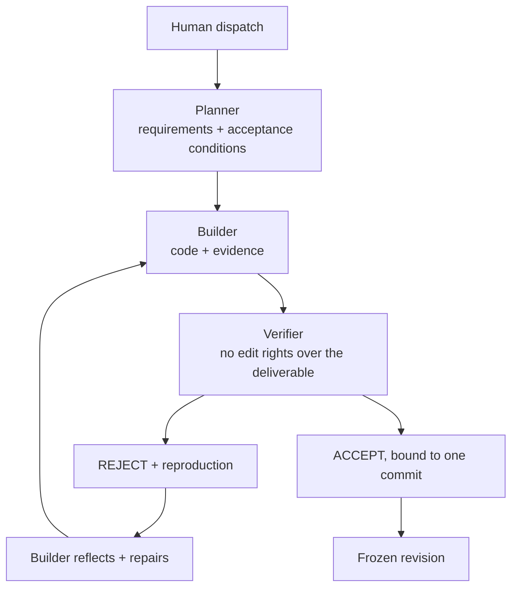
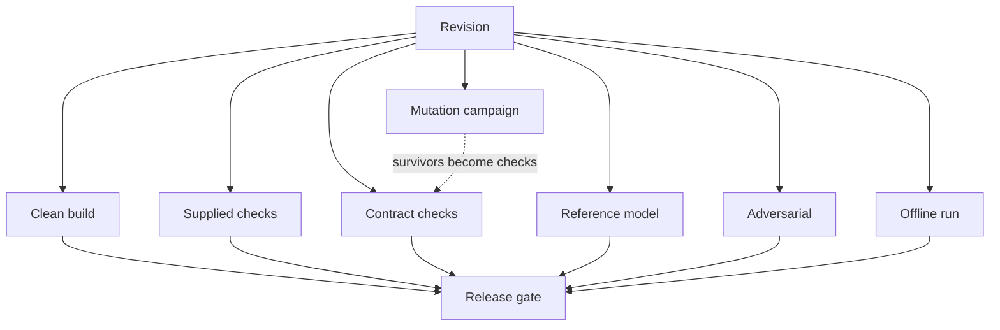
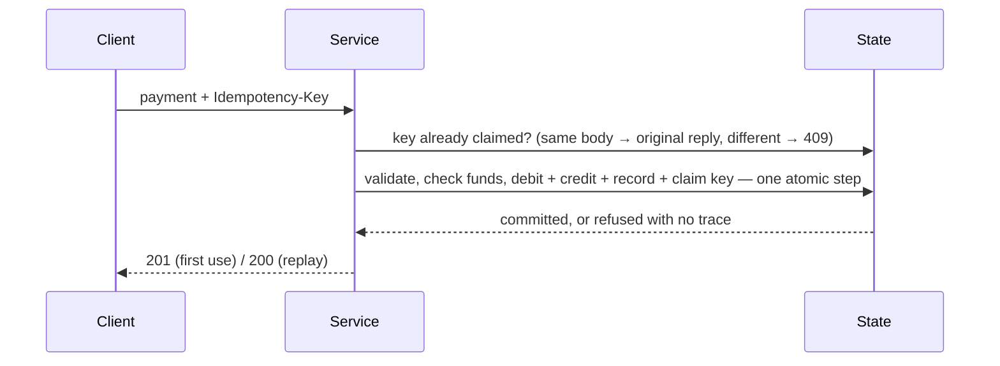

# COMMIT

### The software factory that measures how much bad work it can kill.

> **Don't trust green checks. Measure whether your factory can detect bad work.**

COMMIT is a three-seat autonomous software factory for **BAND Desktop**, built for the
**WeAreDevelopers × BAND Dark Factory** hackathon (track: **Pocketful**). A Planner,
a Builder and an independent Verifier take one human dispatch and carry it through
**plan → build → independent attack → reject or accept → repair → re-verify**, with
no further human input.

What makes it COMMIT rather than "agents plus tests" is that **the verifier's own
strength is measured**: it seeds realistic defects into the candidate and counts how
many its checks kill, drives a reference model and the real service through the same
seeded operation sequences, and attacks the service with concurrent and retried
requests — then reports every number with the command that reproduces it.

**Start here:** [`FACTORY.md`](FACTORY.md) — seats, protocol, toolkit, measured results,
costs and limitations. Mandates: [`mandates/`](mandates/).

---

## The problem

A coding agent can plan, implement, test and report "done" on its own. When the producer
is also the evaluator, a convincing report is not a verified artifact. And a green suite
answers only one question — *did the checks we wrote pass?* — not *would these checks
notice if the code were wrong?*

Coverage does not answer that either: it says which lines ran, not which faults the
suite can detect. **Mutation testing** asks the second question directly, so COMMIT uses
it to measure its own verifier.

## The factory



| Seat | Owns | Never |
|---|---|---|
| **Planner** | numbered requirements, acceptance conditions, ambiguity log, every handoff | writes deliverable code, accepts work |
| **Builder** | the deliverable and its tests | self-approves, weakens a check, rewrites reported history |
| **Verifier** | the verdict, verification code, evidence | edits the deliverable — even to fix a bug it found |

The mandates are **generic**: they name roles, handoffs, evidence and rejection rules,
never this track's endpoints, fields or error codes. They pass the official
`harness check` vocabulary scan for both graded tracks; the specification goes in the
task the human dispatches, not in the mandates.

## The verifier's toolkit (`commit/`)

Zero npm dependencies; runs on Node ≥ 22.18 from a bare checkout.

| Command | Purpose |
|---|---|
| `commit/verify.ts` | run a verification plan against one revision → `evidence.json` (+ sha256), `verdict.md` (ACCEPT / REJECT / INCONCLUSIVE / ERROR), `scorecard.md`, `reproduction.sh`; voids the run if the candidate changed during it |
| `commit/campaign.ts` | seeded reference-model campaign: model and service in lockstep, first divergence with its seed and operation sequence |
| `commit/mutate.ts` | mutation campaign in isolated copies: killed / survived / timeout / invalid / error / equivalent, kill rate, and which verification layer caught each defect |
| `commit/bootstrap.sh` | install the factory into a fresh result repository |



Details: [`docs/factory/verification.md`](docs/factory/verification.md).

## Measured results (verifier calibration)

Before the judged run, the verifier was calibrated against a hand-written Pocketful
stage-1 service (`calibration/`), so its strength is a measured number rather than a
claim. All values below come from artifacts in [`evidence/`](evidence/).

<pending: results table>

## Pocketful, as the factory's test subject

Pocketful is a Venmo-style wallet: send money by handle, request it, split bills, settle
batches — where **money must never be created, destroyed or spent twice** under
concurrent transfers, retries and rounding. It is the right test subject because its
failure modes are exactly the ones a green example-based suite misses: races between a
funds check and a debit, a retry that moves money twice, a split that loses a unit.



The calibration service implements stage 1 of the official specification. Its design is
documented in its source; the one load-bearing decision is that every money-moving
operation runs synchronously within one event-loop turn, so concurrent requests execute
in a serial order without locks (single process; the ceiling and upgrade path are noted
in `calibration/pocketful-stage-1/src/store.ts`).

## Repository

```text
README.md                 this file
FACTORY.md                the factory: seats, protocol, toolkit, results, costs, limits
mandates/                 planner.md, builder.md, verifier.md — generic seat mandates
commit/                   the verifier toolkit (generic; no dependencies)
calibration/
  pocketful-stage-1/      hand-written calibration target (NOT a submission stage)
  verification/           the problem-specific layers a verifier seat would write:
                          contract checks, reference model, adversarial campaigns,
                          kill suite, verification plan, equivalent-mutant register
evidence/calibration/     every report and verdict quoted in this repository
docs/factory/             verification in depth; the reproducibility runbook
apps/ packages/ docs/ docker/   inherited upstream ledger — see Provenance
```

## Reproduce

```sh
pnpm install                      # dev tooling only (typecheck, lint)
pnpm calibration:start &          # the calibration target on :8080
pnpm verify:contract   --base-url http://127.0.0.1:8080
pnpm verify:reference  --base-url http://127.0.0.1:8080 --seed 481927 --operations 1000
pnpm verify:adversarial --base-url http://127.0.0.1:8080 --rounds 5
pnpm verify:mutation              # starts its own candidates
pnpm verify                       # everything, with evidence and a verdict
```

Full runbook, including the clean-container and offline runs:
[`docs/factory/reproducibility.md`](docs/factory/reproducibility.md).

## Stage folders and the BAND run

The event counts only code the band writes in its BAND Desktop room, and grades a
**separate, fresh result repository**. This repository is the factory; it deliberately
contains **no `stage-N/` folders**. To produce a submission:

1. `commit/bootstrap.sh /abs/path/to/result-repo` — installs mandates, toolkit, `FACTORY.md`.
2. Create the Planner, Builder and Verifier seats in BAND Desktop with the mandates.
3. Dispatch the stage task to `@planner` (template in `FACTORY.md` §2) and do not intervene.
4. Download the room as `room.json`, write the result repository's `README.md`, run
   `harness check` and `harness run --all --mode isolated`.

## Research foundation

COMMIT's design is informed by, not a reproduction of, the following work:

- **Agent-as-a-Judge** (Zhuge et al., arXiv:2410.10934) — agentic systems evaluating
  agentic work with intermediate evidence rather than final answers alone. COMMIT applies
  the principle by making a separate seat the only acceptance authority.
- **Reflexion** (Shinn et al., arXiv:2303.11366) and **Self-Refine** (Madaan et al.,
  arXiv:2303.17651) — improvement from verbal feedback. COMMIT adapts the idea with one
  change: the feedback comes from an *independent* verifier with a deterministic
  reproduction, not from the producer's self-critique.
- **Mutation-guided test generation** (Foster et al., Meta's ACH, arXiv:2501.12862) — mutants as the
  target a test suite must kill. COMMIT uses mutants to *measure* the verifier and to
  direct where it writes new checks.
- **Stateful property-based and model-based testing** — generated operation sequences
  checked against a reference model, as in QuickCheck-style state-machine testing and
  Jepsen-style concurrency analysis.

None of this makes the software proven correct. A mutation score measures the suite
against the defects it can model; a reference model agrees only on what it encodes.

## Provenance and license

This repository began as a snapshot of an MIT-licensed double-entry ledger by Plesa
George-Eduard (`LICENSE`, retained unchanged). That code — `apps/`, `packages/`,
`docs/adr/`, `docs/*.md` other than `docs/factory/`, `docker/` and the database tooling
— is **inherited and unused** by COMMIT: the Pocketful specification forbids building
from existing products' source in its domain, and its development database URLs trip the
event's credential scanner, so it must not be copied into a submission. It remains here,
unchanged, for provenance; the first commit records it exactly as received.

Everything under `commit/`, `calibration/`, `mandates/`, `evidence/`, `docs/factory/`,
`README.md` and `FACTORY.md` is new work for this project, released under the same MIT
license.
