# COMMIT

### The software factory that measures how much bad work it can kill.

> **Don't trust green checks. Measure whether your factory can detect bad work.**

COMMIT is an autonomous, evidence-driven software factory built for the **WeAreDevelopers × BAND Dark Factory Hackathon**.

Instead of treating "tests passed" as the end of the engineering process, COMMIT treats verification as a measurable system of its own.

A single human dispatch starts the work.

From there:

**Planner → Builder → Independent Verifier → Reject / Accept → Repair → Re-verify**

The verifier does not trust the builder's report.
It does not silently fix production code.
It does not accept a result because a command returned exit code `0`.

It reconstructs evidence independently.

COMMIT measures how effectively the factory can:

* detect seeded faults,
* kill valid mutants,
* detect invariant violations,
* expose reference-model divergences,
* reproduce failures,
* reject unsupported evidence,
* drive repairs through explicit feedback,
* and independently re-accept a repaired revision.

The goal is not to claim that software is mathematically bug-free.

The goal is to make the **strength of the software factory itself observable and reproducible**.

---

## Why COMMIT Exists

Modern coding agents dramatically reduce the cost of producing code.

They can:

* read specifications,
* create files,
* modify architectures,
* write tests,
* execute commands,
* diagnose failures,
* repair implementations,
* and iterate without constant human intervention.

That changes the bottleneck.

The difficult question is no longer only:

> **"Can an agent write the software?"**

It becomes:

> **"Can an autonomous system reliably determine whether the software it produced is actually acceptable?"**

A green test suite gives only one answer:

```text
The checks we ran passed.
```

It does not automatically answer:

```text
Were the right checks written?

Did the tests exercise the important failure modes?

Did the evidence actually come from this revision?

Would the system survive retries?

Would concurrent operations preserve invariants?

Would a subtle implementation fault escape the suite?

Can an independent evaluator reproduce the result?

Did the repair actually fix the original problem?

Did the factory accidentally accept bad work?
```

COMMIT is designed around that gap.

---

# The Core Problem

## Coding agents create a new verification problem

A traditional software workflow generally has a human somewhere near the acceptance boundary.

A coding agent changes the economics.

A single agent can potentially:

```text
plan
  ↓
implement
  ↓
test
  ↓
observe
  ↓
repair
  ↓
report "done"
```

But the agent performing the work is also the agent describing whether the work succeeded.

That creates a structural trust problem:

> **The producer and the evaluator can become the same entity.**

A system that generates code, generates its own tests, executes those tests, reads the output and declares itself successful can produce a very convincing report without necessarily producing a sufficiently verified artifact.

This is especially dangerous when correctness depends on:

* concurrency,
* retries,
* state transitions,
* atomicity,
* invariants,
* rounding,
* persistence,
* ordering,
* partial failure,
* malformed input,
* or interactions between multiple operations.

---

# The Second Problem: Coverage Is Not Fault Detection

Line and branch coverage answer questions such as:

> "Which parts of the implementation executed?"

Mutation testing asks a different question:

> **"Can the test suite detect a concrete fault injected into the implementation?"**

These are not equivalent.

Recent replicability work on LLM-generated test suites has shown that the relationship between coverage, mutation score, and real-bug detection can be highly context-dependent. In some evaluated settings, very high coverage has coexisted with very low mutation effectiveness.

COMMIT therefore avoids the claim:

> "High coverage means high confidence."

Instead:

> **"Measure how effectively the factory detects seeded faults."**

This distinction is central to the project.

---

# COMMIT's Thesis

## The factory itself must be testable.

Most software systems test their product.

COMMIT also tests the **software factory producing the product**.

That means measuring:

```text
What did the factory accept?
What did it reject?
What faults did it detect?
What faults escaped?
How reproducibly were failures demonstrated?
How many repair cycles were required?
Did independent verification succeed after repair?
```

A factory is therefore treated as an engineering system with measurable outcomes.

---

# The One-Sentence Definition

> **COMMIT is an autonomous multi-agent software factory that makes verification measurable through independent evidence, reference-model testing, property-based invariants, mutation testing, and reproducible rejection-and-repair loops.**

---

# What COMMIT Is

COMMIT is:

* a reusable agent workflow,
* an evidence protocol,
* an independent release gate,
* a fault-detection measurement system,
* a repair-and-reverification loop,
* and a demonstrable implementation of those ideas inside BAND Desktop.

# What COMMIT Is Not

COMMIT is not:

* a generic chatbot,
* a code-generation wrapper,
* a simple test runner,
* a static linter,
* an "AI reviewer" that edits its own findings,
* a claim of formal verification of the complete implementation,
* or a feature-heavy fintech application disguised as a factory.

The application is the demonstration.

The factory is the product.

The evidence is the proof of the claim.

---

# The Central Design Principle

## No seat accepts its own work.

The system deliberately separates responsibilities.

```text
                    ┌──────────────┐
                    │   PLANNER    │
                    │              │
                    │ Plans work   │
                    │ No code edit │
                    │ No approval  │
                    └──────┬───────┘
                           │
                           │ handoff
                           ▼
                    ┌──────────────┐
                    │   BUILDER    │
                    │              │
                    │ Writes code  │
                    │ Runs checks  │
                    │ Reports      │
                    │ evidence     │
                    └──────┬───────┘
                           │
                           │ revision + evidence
                           ▼
                    ┌──────────────┐
                    │  VERIFIER    │
                    │              │
                    │ No code edit │
                    │ Independent  │
                    │ acceptance   │
                    └──────┬───────┘
                           │
                     ┌─────┴─────┐
                     │           │
                     ▼           ▼
                  REJECT       ACCEPT
                     │           │
                     │           │
                     ▼           ▼
                 REFLECTION    IMMUTABLE
                     │          STAGE
                     ▼
                   REPAIR
                     │
                     └──────────────► VERIFIER
```

This separation is intentional.

The builder can explain what it did.

Only the verifier can determine whether the evidence is sufficient.

---

# Architecture

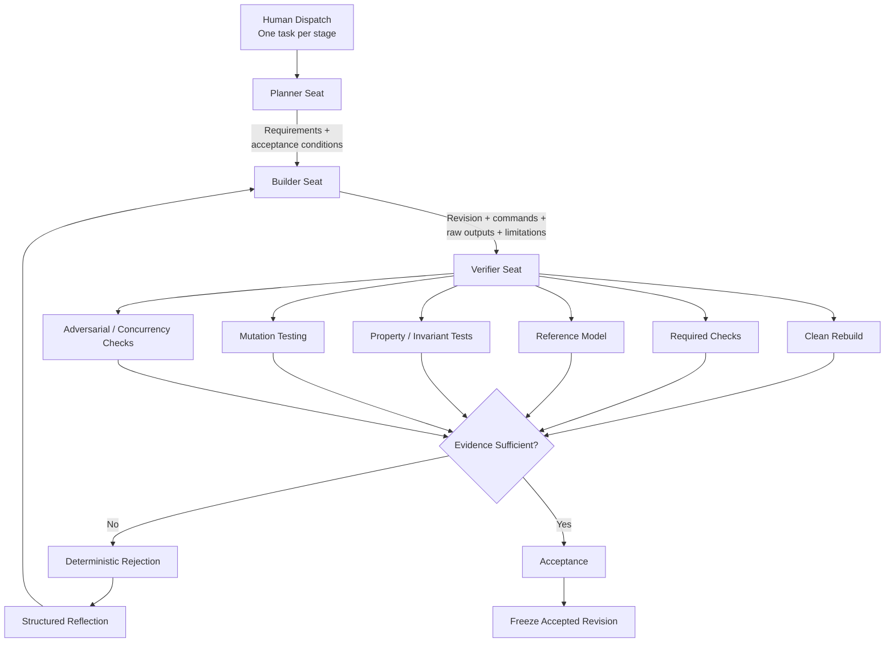

---

# Agent Seats

COMMIT intentionally uses generic standing mandates.

The standing instructions define **how a seat works**.

The dispatched task defines **what problem is being solved**.

This distinction matters.

A reusable factory should be able to move to another domain without rewriting its operating principles.

## Seat 1 — Planner

Responsibilities:

* convert specification text into numbered obligations,
* define acceptance conditions,
* record dependencies,
* identify ambiguous language,
* record conservative interpretations,
* define required evidence,
* create self-contained handoffs.

The planner does **not**:

* modify production code,
* approve the implementation,
* declare tests sufficient,
* or decide that a revision is ready for release.

---

## Seat 2 — Builder

Responsibilities:

* implement assigned work,
* preserve accepted behavior,
* run relevant checks,
* create reviewable commits,
* record exact commands,
* capture actual outputs,
* disclose limitations,
* respond to deterministic verification failures.

The builder does **not**:

* invent test results,
* hide failures,
* mark its own work accepted,
* weaken a failing check merely to obtain a green result,
* or silently reinterpret the specification.

---

## Seat 3 — Verifier

The verifier is COMMIT's release gate.

It operates under a strict constraint:

> **No production-code editing authority.**

The verifier:

1. identifies the exact revision,
2. reconstructs acceptance requirements,
3. rebuilds the revision,
4. independently executes checks,
5. performs adversarial checks,
6. compares against a reference model,
7. evaluates invariants,
8. measures mutation effectiveness,
9. determines whether the evidence is reproducible,
10. accepts or rejects.

A verifier rejection must be useful enough for another seat to reproduce.

A rejection without evidence is not a useful rejection.

An acceptance without independent evidence is not a useful acceptance.

---

# Evidence Is a First-Class Artifact

The fundamental handoff unit in COMMIT is not:

> "Done."

It is:

> **A revision + reproducible evidence + explicit limitations.**

Every builder handoff should answer:

```text
What revision am I reviewing?
What exactly changed?
What commands were executed?
What were their real outputs?
What checks were performed?
What failed?
What remains uncertain?
How can another agent reproduce this?
```

The verifier then generates its own evidence rather than trusting the builder's summary.

---

# Evidence Graph

Every important conclusion should be traceable backward.

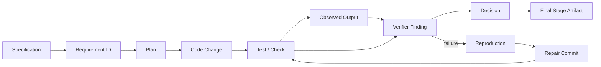

This creates a chain:

```text
Spec
  ↓
Requirement
  ↓
Implementation
  ↓
Check
  ↓
Observed evidence
  ↓
Independent verdict
```

A claim without a trace is weaker than a claim with a reproducible artifact trail.

---

# Verification Pipeline

COMMIT does not rely on one kind of testing.

It uses layers.

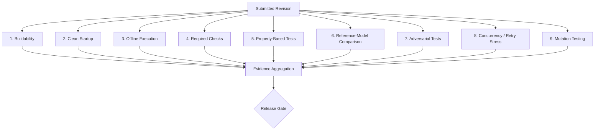

Each layer answers a different question.

### Buildability

**Can the exact submitted revision be built?**

### Startup

**Does the produced service actually start from a clean environment?**

### Offline operation

**Does the service rely on an unexpected external dependency?**

### Required checks

**Does the revision satisfy the known explicit requirements?**

### Property-based testing

**Do general invariants hold over many generated cases?**

### Reference-model comparison

**Does the implementation behave like an independently simplified model?**

### Adversarial testing

**What happens outside the happy path?**

### Concurrency and retry testing

**Does correctness survive repeated or simultaneous operations?**

### Mutation testing

**Can the tests detect deliberately injected faults?**

---

# Mutation Testing

## The measurable core of COMMIT

Mutation testing intentionally introduces controlled faults into a program.

Examples include:

```text
remove a validation condition
change a comparison operator
alter an arithmetic expression
remove an atomicity-related operation
change an ordering rule
bypass an idempotency condition
modify a boundary condition
```

A valid mutant represents a concrete altered behavior.

The test suite either:

```text
KILLS the mutant
```

or:

```text
SURVIVES the mutant
```

The basic metric is:

```text
Mutation Kill Rate = Killed Valid Mutants / Valid Mutants
```

Equivalent mutants should be excluded when they are genuinely behaviorally equivalent to the original.

The resulting metric is **not a proof that the system is bug-free**.

It is a measurable experiment:

> **How effective is this verification system at detecting seeded faults?**

---

# Why Mutation Testing Matters Here

A coding agent can easily produce:

```text
100% test coverage
```

while still missing important behavior.

COMMIT asks a more demanding question:

```text
Can your tests detect a changed implementation?
```

That turns verification strength into something observable.

The factory can report:

```text
Valid mutants:       N
Killed:              K
Survived:            S

Mutation Kill Rate:
K / N
```

And, crucially, the repository preserves the artifacts needed to reproduce the experiment.

---

# Reference-Model Testing

A reference model is a deliberately small and independent description of expected behavior.

For Pocketful, the model represents the core state transition rules independently from the production implementation.

The purpose is not to build a second production system.

It is to create a simple behavioral oracle.

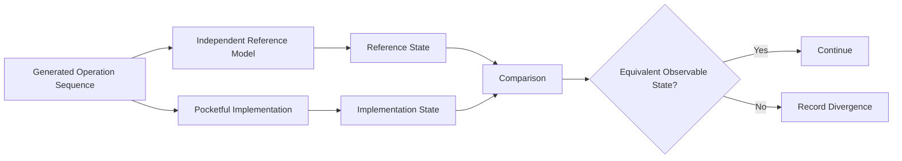

Example replay record:

```text
seed: 481927
operations: 1000

operation_sequence:
  ...

reference_state:
  ...

implementation_state:
  ...

divergence:
  ...

first_divergent_operation:
  ...

reproduction:
  ...
```

The important property is replayability.

A verifier should be able to say:

> "Run this exact seed and operation sequence."

and reproduce the same divergence.

---

# Property-Based Verification

Rather than manually writing one example at a time, COMMIT can generate many valid and invalid operation sequences.

For each generated sequence, the verifier checks properties that must always hold.

For Pocketful, relevant properties include:

```text
debits = credits for every journal transaction

no transaction creates an unexplained accounting imbalance

an atomic transfer has one committed economic effect

a repeated idempotent request does not create additional economic effects

invalid operations do not silently mutate state

state transitions preserve specified invariants
```

Property-based tests are particularly useful because they explore combinations humans may not think to enumerate.

---

# Pocketful

## The Demonstration Application

COMMIT competes in the **Pocketful** track.

Pocketful is intentionally small.

The application exists to provide a difficult enough stateful system through which the factory can demonstrate:

* concurrency,
* retries,
* idempotency,
* atomic state transitions,
* double-entry accounting,
* invariants,
* reference-model comparison,
* and mutation detection.

The product is deliberately not overloaded with unrelated features.

---

# Pocketful Scope

```text
Pocketful
│
├── Accounts
│
├── Balances
│     └── materialized from ledger state
│
├── Transfers
│
├── Journal
│     └── immutable double-entry records
│
├── Idempotency
│     └── sender identity + idempotency identity
│
├── Atomic state transitions
│
└── Responsive interface
```

The objective is not to recreate an entire financial ecosystem.

The objective is to build the required product behavior cleanly enough that COMMIT can attack it.

---

# Accounting Model

For every journal transaction:

```text
Σ debits = Σ credits
```

The ledger is the source of accounting truth.

Materialized balances are derived state.

This makes the critical relationship explicit:

```text
Journal
   ↓
Accounting state
   ↓
Materialized balances
   ↓
Observable application state
```

The implementation should not rely on a loose collection of balance mutations that happen to look correct.

The accounting state transition should be explicit.

---

# Atomic Transfer Model

Conceptually:

```text
Valid Request
     ↓
Validate
     ↓
Begin Atomic Transition
     ↓
Debit Sender
     +
Credit Recipient
     +
Record Journal Entry
     +
Record Idempotency Result
     ↓
Commit
     ↓
One Economic Effect
```

The critical constraint is not merely that each individual database operation succeeds.

The transaction as a whole must preserve its required invariants.

---

# Idempotency

Retries are normal in distributed systems.

Clients may:

* retry after timeouts,
* retry after uncertain responses,
* send duplicate requests,
* experience network instability,
* or accidentally submit the same operation multiple times.

Therefore:

```text
same economic request
+
same idempotency identity
+
concurrent repetition
```

must not silently create multiple economic effects.

An adversarial verifier can generate:

```text
same request
10 concurrent submissions
same idempotency identity
```

and then compare:

```text
number of responses
vs.
number of economic effects
vs.
number of journal transactions
vs.
final state
```

These quantities must satisfy the specification.

---

# Concurrency

Concurrency is not an optional demonstration feature for Pocketful.

It is central to the problem.

A system that passes:

```text
single request
single client
single thread
```

may still fail when exposed to:

```text
concurrent requests
retries
shared state
timeouts
interleavings
```

COMMIT therefore treats concurrency as a verification dimension.

---

# Example Adversarial Campaign

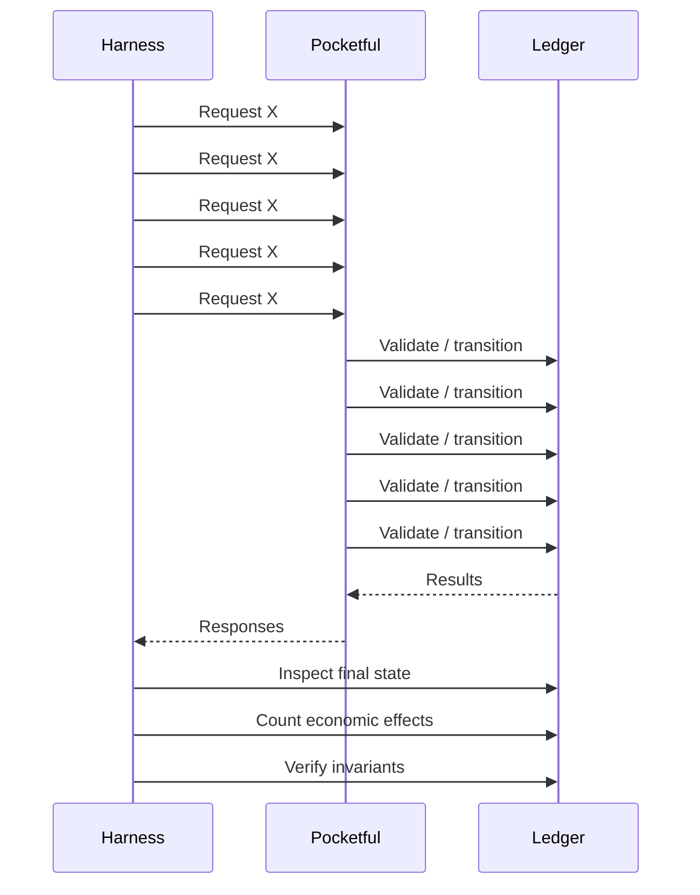

The test is not merely:

> "Did all requests return successfully?"

It is:

> **"What happened to the state?"**

---

# Deliberately Faulty Revision

COMMIT's strongest demonstration is not merely:

```text
everything passed
```

It is:

```text
bad revision
      ↓
independent detection
      ↓
deterministic rejection
      ↓
repair
      ↓
independent acceptance
```

For example, a controlled candidate may contain an idempotency defect that is invisible to a narrow happy-path test.

The public test suite may remain green.

COMMIT's independent campaign introduces a more demanding scenario:

```text
same identity
+
concurrent retry storm
```

The verifier observes an invalid number of economic effects.

It rejects the revision.

The important evidence is:

```text
revision = abc123

test command = ...

seed = ...

concurrency = 10

observed economic effects = ...

expected economic effects = ...

result = REJECT
```

The builder then repairs the implementation.

The verifier runs against the **new exact revision**.

Only the verifier can release it.

---

# Reject → Repair → Re-verify

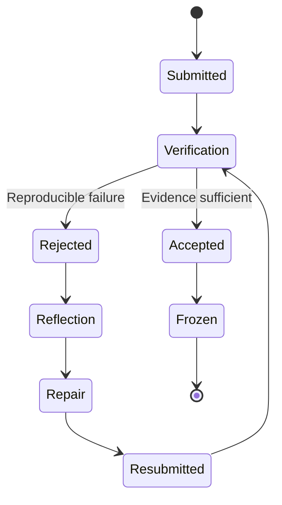

A rejection is not a dead end.

It is a structured feedback signal.

---

# Reflection

COMMIT's repair loop is inspired by work such as:

* **Reflexion** — verbal feedback and episodic memory used to improve later attempts.
* **Self-Refine** — iterative generation, feedback, and refinement.

COMMIT does not claim to reproduce those papers' exact experimental setups.

The design principle is:

```text
failure evidence
      ↓
structured reflection
      ↓
repair hypothesis
      ↓
implementation change
      ↓
independent verification
```

The important distinction is that **external verification produces the feedback signal**.

The builder does not get to grade the repair itself.

---

# Research Foundation

COMMIT is research-inspired, not research-claimed.

## Agent-as-a-Judge

**Agent-as-a-Judge: Evaluate Agents with Agents**
arXiv:2410.10934

The work studies agentic systems evaluating other agentic systems, including process-level and intermediate feedback.

COMMIT applies the general idea as:

> **an independent agentic verification layer that reconstructs acceptance criteria, reproduces evidence, and evaluates both process and outcome.**

COMMIT does not claim that its verifier is identical to the paper's architecture.

---

## Reflexion

**Reflexion: Language Agents with Verbal Reinforcement Learning**
arXiv:2303.11366

The work explores using verbal feedback and episodic memory to improve later attempts.

COMMIT applies the principle to software repair:

```text
Verifier rejection
        ↓
Structured reflection
        ↓
Repair attempt
        ↓
Independent verification
```

The verifier remains independent.

---

## Self-Refine

**Self-Refine: Iterative Refinement with Self-Feedback**
arXiv:2303.17651

The work demonstrates iterative generation → feedback → refinement.

COMMIT extends this idea into a multi-seat factory where the feedback signal comes from an independently constrained verification seat rather than simply the same producer reviewing itself.

---

## Mutation Testing

Mutation testing provides a concrete experimental method for measuring whether tests detect injected faults.

COMMIT uses mutation kill rate as one verification-strength signal.

It does not treat mutation testing as exhaustive correctness proof.

---

## Distributed-System Fuzzing

The design is also informed by stateful, concurrency-oriented testing approaches associated with distributed systems research and practice.

The key idea COMMIT borrows is:

> **Generate difficult execution histories rather than testing only isolated happy paths.**

The verifier therefore combines:

```text
random sequences
+
retries
+
concurrency
+
state comparison
+
invariants
```

---

# COMMIT Evidence Scorecard

Every completed stage should produce a measurable report.

Example schema:

```text
COMMIT — STAGE X FACTORY RESULT

Human dispatches:
    1

Post-dispatch human input:
    0

Planner:
    requirements identified:        <actual>
    acceptance conditions:          <actual>
    ambiguities recorded:           <actual>

Builder:
    revision:                       <commit>
    checks executed:                <actual>
    checks passed:                  <actual>
    checks failed:                  <actual>

Verifier:
    independent checks:             <actual>
    adversarial checks:             <actual>
    invariant checks:               <actual>
    reference-model executions:     <actual>
    clean rebuild:                  PASS / FAIL
    clean startup:                  PASS / FAIL
    offline execution:              PASS / FAIL

Mutation campaign:
    seeded mutants:                 <actual>
    equivalent excluded:            <actual>
    valid mutants:                  <actual>
    mutants killed:                 <actual>
    mutants survived:               <actual>
    mutation kill rate:             <actual>

Defect handling:
    rejected revisions:             <actual>
    reproduced defects:             <actual>
    repair cycles:                  <actual>
    final accepted revisions:       <actual>
    false accepts:                  <actual>

Reference model:
    generated sequences:            <actual>
    divergences:                    <actual>
    first divergent seed:           <actual>

Resources:
    elapsed time:                   <actual>
    tokens / model usage:           <actual>
    seat-level spend:               <actual>

Final verdict:
    ACCEPT / REJECT

Evidence manifest:
    <hash / identifier>
```

**No number is allowed to be hard-coded before the experiment runs.**

The scorecard is generated from the actual execution artifacts.

---

# Why the Scorecard Matters

A normal submission might say:

> "Our agents built the app and everything passed."

COMMIT says:

```text
How many checks?
How many adversarial checks?
How many seeded faults?
How many were detected?
How many were missed?
How many revisions were rejected?
How many repair cycles happened?
Can the exact failure be reproduced?
Can the accepted revision be rebuilt offline?
```

That changes the conversation from:

> **"Trust our demo."**

to:

> **"Replay our evidence."**

---

# Fault-Detection Metrics

COMMIT is designed around measurable experimental quantities.

## Mutation Kill Rate

```text
MK = K / V
```

Where:

* `K` = valid mutants killed
* `V` = valid mutants

Equivalent mutants are excluded where justified.

---

## Fault Detection Rate

For a controlled campaign of known seeded faults:

```text
FDR = detected seeded faults / seeded faults
```

This is meaningful only within the defined campaign.

It is not a universal measure of all possible software defects.

---

## Repair Success

For revisions that were rejected and subsequently repaired:

```text
Repair Success Rate =
repaired revisions independently accepted
/
revisions requiring repair
```

Again, this is a campaign metric rather than an absolute guarantee.

---

## Reference Divergence Count

```text
Reference Divergences =
number of generated executions
where observable implementation behavior
does not match the independent model
```

Every divergence should have:

```text
seed
operation sequence
first divergence
observed state
expected state
reproduction command
```

---

## False Accepts

A false accept is a controlled experimental outcome where:

```text
known faulty candidate
+
verifier campaign
=
ACCEPT
```

This metric is especially important.

A factory that reports only successful detections is incomplete.

COMMIT should also expose what it failed to catch.

---

# Evidence Integrity

COMMIT can produce an evidence manifest containing:

```text
stage
revision
commands
test identifiers
seeds
outputs
timestamps
verdict
mutation statistics
environment metadata
```

An evidence hash may be used as an integrity identifier for the manifest.

Important:

> **Hashing the evidence does not prove that the software is correct.**

It helps identify whether the evidence artifact itself changed.

Correctness still depends on the underlying checks and their assumptions.

---

# Autonomy Model

The factory is designed around the hackathon's autonomy requirement.

The human provides the task.

After dispatch:

```text
No steering
No manual approval
No human patching
No rerun requests
No hidden intervention
```

The agents must complete the workflow themselves.

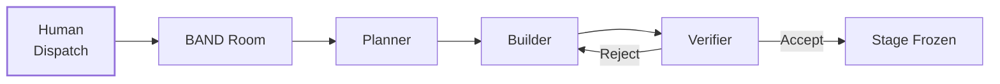

The important evidence is therefore not:

> "The system could work autonomously."

It is:

> **"Here is the actual room run where the human dispatched the stage and the seats carried the work through the workflow."**

---

# BAND Desktop Integration

COMMIT is designed to run as a genuine multi-seat workflow inside **BAND Desktop**.

The BAND room provides the coordination environment in which agents:

* receive tasks,
* exchange context,
* hand off work,
* report evidence,
* expose failures,
* and record decisions.

The repository should preserve the relevant room export as part of the submission artifact.

This is important because the factory is not demonstrated solely by the final source code.

The room is part of the evidence.

---

# BAND Workflow

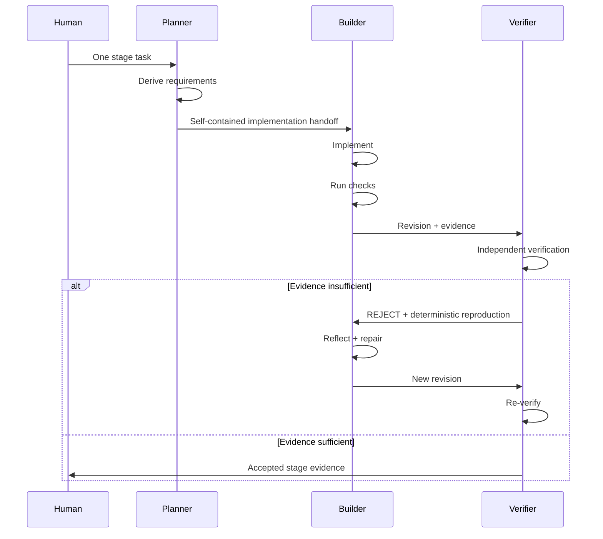

The human is not acting as a hidden coordinator inside the loop.

---

# Generic Mandates

The standing seat mandates deliberately avoid domain-specific vocabulary.

They should not contain:

```text
Pocketful
Tablekeeper
wallet
payment
transfer endpoint
specific fields
specific status codes
track-specific constraints
```

Those belong in the stage task.

The standing mandate should instead describe:

```text
ownership
workflow
handoff format
evidence requirements
refusal conditions
acceptance authority
```

This is what makes the factory reusable.

---

# Reusability

The ideal test of a factory is:

> **Could the same mandates be handed to a different software project?**

COMMIT is designed so the answer is yes.

The domain-specific input changes.

The factory protocol does not.

```text
GENERIC FACTORY
      +
DOMAIN TASK
      ↓
SOFTWARE RESULT
```

This separates the factory from the product.

---

# Stage Model

The hackathon organizes the build as progressive stages.

COMMIT treats each stage as a bounded release candidate.

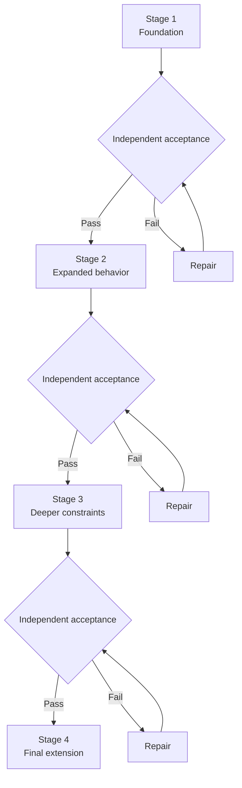

An accepted stage becomes a stable baseline for the next stage.

The factory should never silently overwrite the evidence of what was previously accepted.

---

# Repository Structure

A suggested submission structure:

```text
.
├── README.md
├── FACTORY.md
│
├── mandates/
│   ├── planner.md
│   ├── builder.md
│   └── verifier.md
│
├── band/
│   ├── room-export/
│   └── run-artifacts/
│
├── stage-1/
│   ├── ...
│   └── README.md
│
├── stage-2/
│   ├── ...
│   └── README.md
│
├── stage-3/
│   ├── ...
│   └── README.md
│
├── stage-4/
│   ├── ...
│   └── README.md
│
├── verification/
│   ├── mutations/
│   ├── reference-model/
│   ├── properties/
│   ├── adversarial/
│   └── reports/
│
└── docs/
    ├── architecture.md
    ├── evidence-protocol.md
    └── reproducibility.md
```

Only stages that are actually completed and independently verified should be submitted.

---

# Stage Artifact Contract

Each completed stage should expose enough information for a judge to understand:

```text
What exists?
How is it built?
How is it started?
What checks were run?
What evidence exists?
What revision was accepted?
What limitations remain?
```

A completed stage is more valuable than an ambitious but non-reproducible stage.

---

# Clean-Container Reproducibility

COMMIT treats clean startup as a release requirement.

The final artifact should be testable from:

```text
clean container
+
no outbound network
+
fresh environment
```

Conceptually:

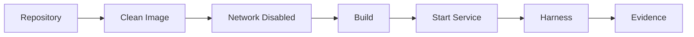

The purpose is reproducibility.

A sandbox does not prove correctness by itself.

It proves that the artifact can be reconstructed and executed under controlled conditions.

The actual correctness evidence comes from the verification layers.

---

# Offline Assumption

The judged service should not secretly depend on:

```text
external APIs
remote databases
network downloads
uncached packages
runtime cloud calls
```

The clean-container test should surface such dependencies before submission.

An application that only works on the author's machine is not a reproducible factory output.

---

# Verification Artifact Format

A useful verifier report can follow this model:

```text
COMMIT VERIFICATION REPORT

Stage:
Revision:

Specification basis:
    ...

Build:
    PASS / FAIL

Startup:
    PASS / FAIL

Offline:
    PASS / FAIL

Required checks:
    ...

Independent checks:
    ...

Property checks:
    ...

Reference-model checks:
    ...

Adversarial checks:
    ...

Mutation campaign:
    total:
    valid:
    killed:
    survived:
    kill rate:

Failures reproduced:
    ...

Limitations:
    ...

Verdict:
    ACCEPT / REJECT
```

For a rejection:

```text
VERIFICATION REJECTION

Revision:
Requirement:
Observed:
Expected:
Reproduction:
Command:
Seed:
Evidence:
Recommended repair scope:
```

The verifier should give enough information to reproduce the issue without taking over implementation.

---

# Example Rejection

```text
REJECT

Revision:
    abc123

Failure class:
    Retry / concurrency invariant violation

Reproduction:
    seed=481927
    concurrency=10
    identical idempotency identity

Observed:
    3 economic effects

Expected:
    1 economic effect

Invariant violated:
    repeated request must not create
    additional economic effect

Evidence:
    <captured command/output>

Production modification:
    none

Next action:
    Builder must repair and submit a new revision.
```

The important property is that the verifier **does not patch the code**.

---

# Example Acceptance

```text
ACCEPT

Revision:
    def456

Clean build:
    PASS

Clean startup:
    PASS

Offline:
    PASS

Required checks:
    PASS

Independent checks:
    PASS

Reference model:
    PASS

Invariant checks:
    PASS

Concurrency / retry campaign:
    PASS

Mutation campaign:
    <actual result>

Previous rejection:
    resolved

Independent reproduction:
    PASS

Stage:
    FROZEN
```

---

# Failure Philosophy

COMMIT does not treat failure as something to hide.

A mature factory should expose:

```text
what failed
why it failed
who detected it
whether it was reproduced
what changed
whether the repair worked
```

This means a failed check can become valuable evidence.

A hidden failure is dangerous.

A reproduced failure is information.

A verified repair is progress.

---

# What Makes COMMIT Different

The goal is not to win by adding the longest feature list.

The differentiator is the **measurement loop**.

| Traditional Agent Workflow  | COMMIT                               |
| --------------------------- | ------------------------------------ |
| Agent writes code           | Builder writes code                  |
| Agent runs tests            | Builder reports evidence             |
| Agent says "pass"           | Verifier independently checks        |
| Coverage used as confidence | Fault detection measured             |
| Review may be subjective    | Findings tied to evidence            |
| Bug found manually          | Seeded faults can be measured        |
| Repair is often opaque      | Rejection → repair → re-verification |
| Final result matters most   | Factory behavior is also measured    |
| Success is claimed          | Evidence is replayable               |

The defining metric is therefore not:

```text
lines of code
```

or:

```textnumber of agents
```

or:

```textnumber of features
```

It is:

> **How much bad work did the factory successfully detect before acceptance?**

---

# Why Three Seats Are Enough

More agents do not automatically create a better factory.

COMMIT's minimal separation is:

```text
Planner
Builder
Verifier
```

That provides three distinct responsibilities:

```text
understand
    ↓
implement
    ↓
judge
```

A fourth seat can be added later for evidence/cost analysis, adversarial generation or specialized analysis, but it should solve a real bottleneck rather than exist merely to increase the agent count.

---

# Optional Fourth Seat

A future fourth seat can own:

```text
Evidence / Cost Analyst
```

It can measure:

* elapsed time,
* resource usage,
* mutation campaign size,
* verification coverage,
* repair cycles,
* rejection frequency,
* reproducibility metadata.

Its job is measurement.

It should not become a hidden approval authority.

---

# Factory Control Rules

COMMIT's internal governance can be summarized as:

```text
1. The planner plans.
2. The builder builds.
3. The verifier verifies.
4. The verifier does not repair.
5. The builder does not self-accept.
6. Evidence must be reproducible.
7. Failures must be disclosed.
8. Accepted revisions are frozen.
9. Human steering is outside the submitted autonomous run.
10. Metrics come from actual execution.
```

---

# Security and Integrity Considerations

Although Pocketful is a demonstration application, the factory is designed around principles that become increasingly important as software agents gain more execution authority.

## Separation of authority

The seat that creates software should not automatically control release.

## Evidence traceability

Important decisions should reference concrete artifacts.

## Reproducibility

Critical findings should be executable again.

## Least privilege

Verification should not require write access to the production implementation.

## Explicit failure states

A failed check should not silently become a pass.

## No invented evidence

Agents must not fabricate:

```text
test results
performance measurements
coverage numbers
mutation scores
```

---

# Failure Modes COMMIT Explicitly Targets

```text
┌─────────────────────────────────────────────┐
│ Failure Mode                                │
├─────────────────────────────────────────────┤
│ Builder claims a test passed without run    │
│ Public tests miss important edge behavior   │
│ Retry creates duplicate economic effect     │
│ Concurrent operations corrupt shared state  │
│ Hidden invariant violation                  │
│ Reference-model divergence                  │
│ Mutation survives                           │
│ Repair fixes one case but breaks another    │
│ Revision differs from reported revision     │
│ Service works locally but not cleanly       │
│ Offline execution unexpectedly fails        │
│ Human intervention silently steers the run  │
└─────────────────────────────────────────────┘
```

The factory is not required to eliminate every failure.

It is required to make the verification boundary stronger and more observable.

---

# Design Decision: Why the Verifier Cannot Edit

At first glance, allowing the verifier to patch a bug seems faster.

COMMIT deliberately rejects that design.

If one agent can:

```text
find bug
+
fix bug
+
approve fix
```

then the independence boundary disappears.

Instead:

```text
Verifier:
    identify failure
    provide evidence
    reject

Builder:
    repair

Verifier:
    independently re-check
```

This creates a clean separation of duties.

---

# Design Decision: Why the App Stays Small

Every feature creates more:

```text
code
tests
state
failure modes
verification surface
UI
maintenance
```

The factory is the main competition artifact.

Pocketful therefore remains compact enough that the factory can attack it deeply.

The strategy is:

> **Less product surface. More verification depth.**

---

# Design Decision: Why No Giant Dashboard

A dashboard can visualize metrics.

It does not create metrics.

COMMIT therefore prioritizes:

```text
raw evidence
    ↓
structured report
    ↓
reproducible scorecard
```

A polished UI is useful for the application.

The factory's credibility comes from its artifacts.

---

# Design Decision: Why No "Perfect Correctness" Claim

There is no single test campaign capable of establishing that a non-trivial software system can never fail under every possible input, environment and execution schedule.

COMMIT therefore makes a narrower and more defensible claim:

> **We measure the effectiveness of our verification factory against defined seeded-fault, adversarial, invariant and model-based campaigns.**

That is measurable.

That is reproducible.

That is falsifiable.

---

# The Evidence Flywheel

The factory improves through a feedback loop:

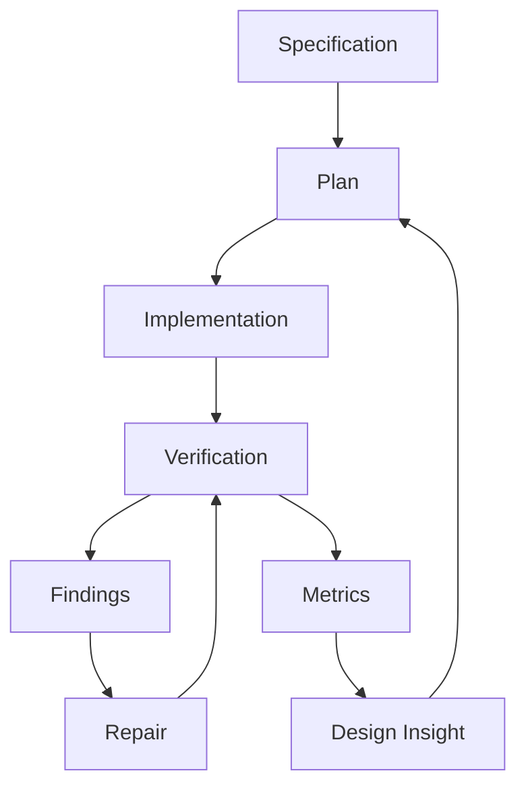

Every run creates data about:

```text
what the factory catches
what it misses
how expensive verification is
which failure classes recur
which tests are weak
which handoffs are ambiguous
```

That is the beginning of an engineering feedback system around agentic software production.

---

# Future Direction

The immediate goal is the hackathon factory.

The longer-term direction is a generalized **release-gate protocol for agent-built software**.

Potential future capabilities include:

```text
mutation campaign generation
reference-model synthesis
automatic adversarial scenario generation
cross-model verification
historical failure memory
test-strength regression tracking
verification-cost optimization
continuous factory benchmarking
```

These are future directions, not claims about the current implementation.

---

# Roadmap

## Phase 1 — Factory Foundation

```text
[ ] Generic planner mandate
[ ] Generic builder mandate
[ ] Generic verifier mandate
[ ] Evidence handoff format
[ ] BAND room workflow
[ ] Acceptance / rejection protocol
```

## Phase 2 — Pocketful Core

```text
[ ] Accounts
[ ] Ledger
[ ] Transfers
[ ] Idempotency
[ ] Atomic state transitions
[ ] Responsive UI
```

## Phase 3 — Verification Depth

```text
[ ] Property-based checks
[ ] Independent reference model
[ ] Concurrent retry campaign
[ ] Invariant checker
[ ] Mutation harness
[ ] Replayable seeds
```

## Phase 4 — Evidence System

```text
[ ] Automatic scorecard
[ ] Machine-readable evidence manifest
[ ] Reproduction bundle
[ ] Resource accounting
[ ] Accepted-stage freeze
```

## Phase 5 — Hardening

```text
[ ] Clean build
[ ] Offline startup
[ ] Stage regression
[ ] Repository audit
[ ] BAND room export
[ ] Final walkthrough
```

---

# Judge-Oriented Reading Order

A judge should be able to understand the project in this order:

```text
1. COMMIT thesis
2. Why ordinary green tests are insufficient
3. Factory architecture
4. Three-seat separation
5. Verification layers
6. Mutation kill measurement
7. Reference-model comparison
8. Pocketful demonstration
9. Rejection → repair → acceptance
10. Evidence scorecard
11. Reproducibility
12. BAND room evidence
```

The most important artifact is not a screenshot.

It is a **replayable causal chain**.

---

# The Demonstration Story

The intended demonstration is a single autonomous run.

## Scene 1 — Dispatch

The human submits one task for the stage.

Nothing else is manually steered.

---

## Scene 2 — Planning

The planner produces:

```text
R001
R002
R003
...
```

with:

```text
acceptance condition
dependency
evidence requirement
ambiguity ruling
```

---

## Scene 3 — Implementation

The builder produces:

```text
revision: abc123
```

and records:

```text
commands
outputs
tests
limitations
```

---

## Scene 4 — Fault

A controlled faulty revision is introduced into the verification campaign.

Example category:

```text
idempotency bypass
```

The normal happy-path checks remain green.

---

## Scene 5 — Independent Rejection

The verifier runs the adversarial campaign.

It observes an invalid state transition.

```text
REJECT

Revision:
    abc123

Observed:
    <actual>

Expected:
    <actual>

Reproduction:
    <actual>
```

---

## Scene 6 — Repair

The builder reads the evidence.

It produces:

```text
revision: def456
```

and documents the repair.

---

## Scene 7 — Acceptance

The verifier starts from the new revision.

```text
BUILD          PASS
STARTUP        PASS
OFFLINE        PASS
REQUIRED       PASS
INDEPENDENT    PASS
REFERENCE      PASS
INVARIANTS     PASS
ADVERSARIAL    PASS
MUTATION       <actual>

ACCEPT
```

That sequence is the product demonstration.

---

# The Causal Chain

```text
Specification
      ↓
Requirements
      ↓
Plan
      ↓
Implementation
      ↓
Evidence
      ↓
Independent verification
      ↓
Failure
      ↓
Deterministic rejection
      ↓
Reflection
      ↓
Repair
      ↓
Independent re-verification
      ↓
Acceptance
      ↓
Measured factory result
```

This is the core narrative of COMMIT.

---

# Submission Discipline

For the Dark Factory challenge, the repository must satisfy the competition's structural requirements.

The expected package includes:

```text
Public GitHub repository
        +
3+ coding-agent seats
        +
generic mandates
        +
completed stage folders
        +
FACTORY.md
        +
BAND room export
        +
video containing the actual BAND room
        +
clean offline service startup
```

The hackathon explicitly states that a mandate containing track-specific details can disqualify an entry, a video without the BAND Desktop room recording disqualifies the team, and a service that does not start from a clean container scores zero.

COMMIT therefore treats these not as administrative details, but as release criteria.

---

# Validation Checklist

Before submission:

```text
FACTORY
[ ] 3+ distinct coding-agent seats
[ ] Standing mandates are generic
[ ] Planner does not edit production code
[ ] Builder does not accept own work
[ ] Verifier cannot modify production code
[ ] Handoffs carry complete evidence
[ ] Rejection is deterministic
[ ] Repair returns to independent verification
[ ] Metrics are generated from real runs

APPLICATION
[ ] Pocketful core implemented
[ ] Required behavior preserved
[ ] UI coherent and responsive
[ ] Clean build succeeds
[ ] Clean startup succeeds

VERIFICATION
[ ] Independent checks run
[ ] Invariant checks run
[ ] Reference model runs
[ ] Adversarial checks run
[ ] Mutation campaign runs
[ ] Seeds are recorded
[ ] Reproductions are recorded
[ ] Surviving mutants are disclosed

AUTONOMY
[ ] One human dispatch per submitted stage
[ ] No hidden steering
[ ] No manual approval
[ ] No manual code patch
[ ] No manual rerun

EVIDENCE
[ ] BAND room export included
[ ] Actual room appears in video
[ ] Repository matches demonstrated revision
[ ] Scorecard contains actual numbers
[ ] Limitations are disclosed
```

---

# Limitations

COMMIT deliberately does not claim:

* exhaustive bug discovery,
* formal proof of production correctness,
* that mutation score perfectly predicts real-world bugs,
* that a reference model catches every implementation error,
* that a clean container guarantees semantic correctness,
* or that autonomous verification eliminates all human engineering responsibility.

Instead, COMMIT makes a narrower claim that can be tested:

> **A software factory can expose and measure the strength of its own verification process using reproducible fault-detection experiments.**

---

# Anti-Patterns COMMIT Rejects

## "Everything passed."

Without evidence, this is incomplete.

## "Coverage is 100%."

Coverage alone does not establish fault-detection strength.

## "We use an auditor."

Independent review by itself is not enough.

## "Docker proves correctness."

A sandbox proves controlled execution, not semantic correctness.

## "Hashing proves the ledger is correct."

A hash chain can improve tamper evidence; it does not establish that the underlying transaction was valid.

## "We have more agents."

Agent count is not a substitute for separation of responsibility.

## "We caught one bug."

One bug demonstration is useful, but measurement across a defined fault campaign is stronger.

---

# The COMMIT Standard

A revision should not be accepted merely because:

```text
the code exists
```

or:

```text
the tests are green
```

The factory should ask:

```text
Can we rebuild it?
Can we reproduce the claimed evidence?
Can we independently exercise important failure modes?
Can we detect seeded faults?
Can we preserve the required invariants?
Can we explain any rejection?
Can we reproduce the repair?
Can we independently accept the new revision?
```

That is the COMMIT standard.

---

# The Core Formula

COMMIT can be thought of as:

```text
             Evidence
                  +
        Independent Judgment
                  +
        Fault Injection
                  +
       Stateful Verification
                  +
        Reproducibility
                  +
       Autonomous Recovery
                  ↓
       Measurable Factory Quality
```

Or more simply:

```text
        BUILD
          ↓
       ATTACK
          ↓
       MEASURE
          ↓
       REJECT
          ↓
       REPAIR
          ↓
       RE-VERIFY
          ↓
       ACCEPT
```

---

# Why the Name COMMIT

A commit is supposed to represent a concrete, traceable state of software.

COMMIT extends that idea into the release process.

A revision should not merely be:

```text
code + timestamp
```

It should be associated with:

```text
code
+
requirements
+
evidence
+
verification
+
decision
```

The factory therefore treats acceptance as a commitment backed by evidence.

---

# Philosophy

> **Agents should not be trusted because they sound confident.**

> **Tests should not be trusted because they are numerous.**

> **Coverage should not be trusted as a proxy for fault detection.**

> **Verification should be independently reproduced.**

> **Failures should generate evidence.**

> **Repairs should return through the same independent gate.**

> **Factory quality should be measurable.**

---

# Closing Thesis

Software agents are becoming increasingly capable of producing software.

The next challenge is not simply making them faster.

It is making the **process that accepts their output trustworthy enough to run without a person hovering over every step**.

COMMIT approaches that problem by separating creation from judgment and turning verification from a binary:

```text
PASS / FAIL
```

into a measurable experiment:

```text
What did we test?
What did we attack?
What did we detect?
What survived?
What did we reject?
What did we repair?
What did we independently reproduce?
What did we finally accept?
```

The result is a different kind of software factory.

Not a factory that merely produces code.

A factory that can measure how much **bad work it can kill before it ships**.

---

# Research References

The following works informed COMMIT's design:

### Agentic Evaluation

**Agent-as-a-Judge: Evaluate Agents with Agents**
arXiv:2410.10934

### Iterative Agent Improvement

**Reflexion: Language Agents with Verbal Reinforcement Learning**
arXiv:2303.11366

### Iterative Refinement

**Self-Refine: Iterative Refinement with Self-Feedback**
arXiv:2303.17651

### Mutation Testing

**ACH / mutation-guided evaluation of LLM-generated tests**
arXiv:2501.12862

### Distributed / Stateful Testing

Research on grey-box fuzzing, stateful testing, and event-timeline-guided exploration informs the reference-model and adversarial-testing direction.

These papers are inspiration and methodological references, not claims that COMMIT reproduces their exact experimental setups or results.

---

# Built For

**WeAreDevelopers × BAND — Dark Factory Hackathon**

Track:

**Pocketful**

Factory:

**COMMIT**

Core idea:

> **Evidence before acceptance.**

---

# Final Mental Model

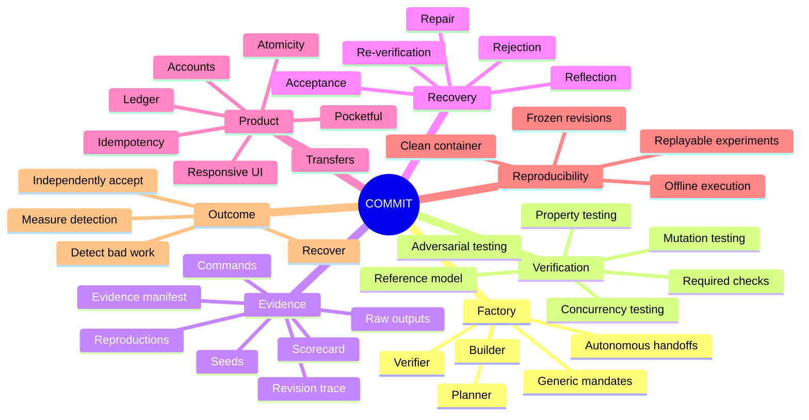

---

## COMMIT

**The software factory that measures how much bad work it can kill.**

**Build with agents.**

**Attack what they build.**

**Measure what you catch.**

**Reject what fails.**

**Repair with evidence.**

**Accept only what another seat can independently reproduce.**
