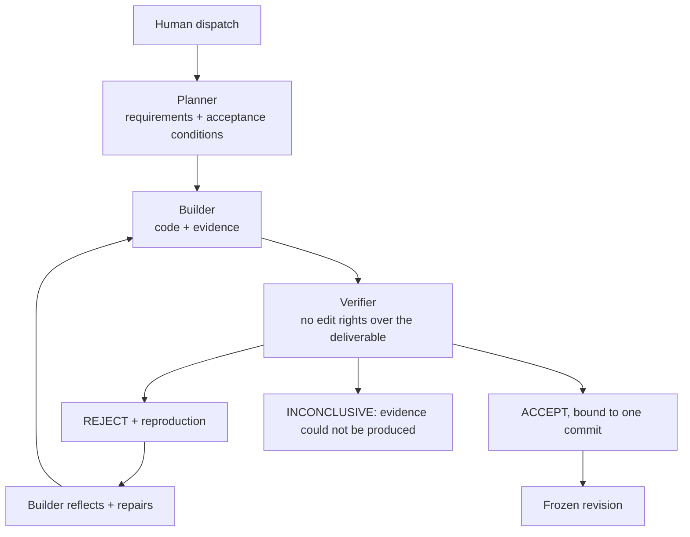

# COMMIT

### The software factory that measures how much bad work it can kill.

> **Don't trust green checks. Measure whether your factory can detect bad work.**

COMMIT is a three-seat autonomous software factory for **BAND Desktop**, built for the
**WeAreDevelopers × BAND Dark Factory** hackathon (track: Pocketful). A **Planner**, a
**Builder** and an independent **Verifier** take one human dispatch and carry it through
**plan → build → independent attack → reject or accept → repair → re-verify** with no
further human input.

What makes it COMMIT rather than "agents plus tests" is that **the verifier's strength is
itself measured**: it seeds realistic defects into a candidate and counts how many its
checks kill, drives a reference model and the real service through the same seeded
operations, attacks the service with concurrent and retried requests, and records every
number with the command that reproduces it.

- **[`FACTORY.md`](FACTORY.md)** — seats, protocol, toolkit, verdict lifecycle, measured results, costs, limitations.
- **[`mandates/`](mandates/)** — the three generic seat mandates.
- **[`docs/production-readiness.md`](docs/production-readiness.md)** — what is tested, what is not, and the evidence for each.

---

## The problem

A coding agent can plan, implement, test and report "done" on its own — so the producer
and the evaluator can be the same entity, and a convincing report is not a verified
artifact. A green suite answers *did the checks we wrote pass?*, not *would these checks
notice if the code were wrong?* Coverage does not answer that either; mutation testing
does, so COMMIT uses it to measure its own verifier.

## The factory



| Seat | Owns | Never |
|---|---|---|
| **Planner** | numbered requirements, acceptance conditions, ambiguity log, every handoff | writes deliverable code, accepts work |
| **Builder** | the deliverable and its tests | self-approves, weakens a check, rewrites reported history |
| **Verifier** | the verdict, verification code, evidence | edits the deliverable — even to fix a bug it found |

The mandates are generic — roles, handoffs, evidence and rejection rules, never a track's
endpoints, fields or error codes — and the factory checks that on every run with the
event's own scanner, against both graded tracks.

## The toolkit (`commit/`)

Node ≥ 22.18, no npm dependencies. One entry point: `node commit/cli.ts <command>`.

| Command | Purpose |
|---|---|
| `verify` | run a verification plan against one revision → evidence manifest (schema v2, sha256), `verdict.md`, `scorecard.md`, `reproduction.sh`. Verdicts **ACCEPT / REJECT / INCONCLUSIVE / ERROR**; missing, contradictory or unattributable evidence can never become ACCEPT |
| `mutate` | mutation campaign in isolated copies: killed / survived / timeout / invalid / error / equivalent, kill rate, kills per verification layer, `--only` replay |
| `campaign` | seeded reference-model campaign; the seed plus the module hash reproduce it |
| `audit` | check evidence directories for contradictions and after-the-fact edits |
| `doctor` | what this machine can run: Node, git, Docker *daemon* (not just binary), Python |

`commit/bootstrap.sh` installs the factory — and only the factory — into a fresh result
repository, safely and idempotently.

## Measured results

The verifier was calibrated against a hand-written Pocketful stage-1 service
([`calibration/`](calibration/README.md) — **calibration only, never a submission**).

| Measure | Result |
|---|---|
| Official shipped stage-1 checks | 147 / 147 |
| Contract checks (one per spec rule, incl. import-corruption fuzz) | 248 / 248 |
| Reference model — 3 seeds × 1,000 generated operations | agree; 6,300 invariant checks |
| Adversarial concurrency / retry campaigns | 55 / 55 rounds, 50 concurrent requests per burst |
| **Mutation kill rate**, campaigns #1 → #2 → #3 → #4 → #5 | **64.0% → 79.7% → 95.4% → 95.4% → 95.4%** (83.8% counting the 58 justified equivalents as survivors; #4 and #5 reproduced #3 exactly on the rewritten engine) |
| Defects killed *only* by the verifier's own contract layer | 97 of 398 |
| Seeded double-spend (rehearsal) | shipped checks green; **REJECTED** by the adversarial layer — 24 payments under one key |
| Clean-container build and offline run | **not run** — no Docker daemon on the calibration machine |
| Overshoot probe (stage-1 must fail the stage-2 suite) | the stage-2 hold check ran and failed, as required — vacuous in runs before rc.2 ([`FACTORY.md` §8](FACTORY.md#8-what-we-tried-that-failed-and-what-it-taught-the-factory)) |
| Latest verdict (`bcc73e9`, factory 1.0.0-rc.2) | **INCONCLUSIVE**: nothing failed; the only reasons are the two Docker steps |
| Factory self-audit (`pnpm verify`) | see [`evidence/factory-self-audit/summary.md`](evidence/factory-self-audit/summary.md) |

Evidence: [`evidence/calibration/stage-1/run-20261002T033320Z/verdict.md`](evidence/calibration/stage-1/run-20261002T033320Z/verdict.md) · [`scorecard.md`](evidence/calibration/stage-1/run-20261002T033320Z/scorecard.md) ·
[all runs](evidence/calibration/stage-1/) · [repair-loop rehearsal](evidence/calibration/stage-1/repair-loop/).
The 18 remaining survivors are listed in [`FACTORY.md` §6](FACTORY.md#6-measured-results--verifier-calibration).

The mutation score measures the verifier against the defects it can model; it is not a
claim that the service is correct, and agreement with a reference model is not proof.

## Reproduce

```sh
pnpm install          # dev tooling only (typecheck, lint)
pnpm doctor           # what this machine can verify
pnpm verify           # factory self-audit, ~1.5 min -> evidence/factory-self-audit/
pnpm verify:full      # + full calibration verification with mutation, ~40 min
pnpm test             # the factory's own tests
```

Runbook: [`docs/factory/reproducibility.md`](docs/factory/reproducibility.md).

## From this repository to a submission

This is the **factory repository**. The event grades a separate, fresh **result
repository** whose stage folders the band writes in its BAND Desktop room; this
repository therefore contains no `stage-N/` folders and never will.

1. `commit/bootstrap.sh --check /abs/path/to/result-repo`
2. In `mandates/*.md` of the result repository, replace the `Harness:` and `Model:`
   placeholders with what each BAND seat actually runs.
3. Create the **Planner**, **Builder** and **Verifier** seats in BAND Desktop; dispatch the
   stage task to `@planner` ([`FACTORY.md` §2](FACTORY.md#2-standing-it-up)); do not intervene.
4. Download the room as `room.json`; write the result repository's README; run
   `harness check` and `harness run --all --mode isolated`.

## Repository layout

```text
FACTORY.md, README.md     the factory, in depth / this entry point
mandates/                 planner.md, builder.md, verifier.md (generic, versioned)
commit/                   the generic toolkit, its tests, bootstrap.sh, VERSION
scripts/self-audit.ts     this repository's own health check (pnpm verify)
calibration/              CALIBRATION ONLY: hand-written target + its verification layers
evidence/                 every verification run, campaign and self-audit quoted anywhere
docs/factory/             verification in depth, reproducibility runbook
docs/production-readiness.md
apps/ packages/ docs/adr/ docs/*.md docker/   inherited upstream ledger (see Provenance)
```

## Research foundation

Design inspiration, not reproduced results:

- **Agent-as-a-Judge** (Zhuge et al., arXiv:2410.10934) — agents evaluating agentic work
  from intermediate evidence; COMMIT makes a separate seat the only acceptance authority.
- **Reflexion** (Shinn et al., arXiv:2303.11366) and **Self-Refine** (Madaan et al.,
  arXiv:2303.17651) — improvement from verbal feedback; in COMMIT the feedback comes from
  an independent verifier with a deterministic reproduction, not from self-critique.
- **Mutation-guided test generation at Meta** (Foster et al., arXiv:2501.12862) —
  mutants as targets a suite must kill; COMMIT uses them to measure its verifier.
- Stateful model-based testing (QuickCheck-style state machines) and Jepsen-style
  concurrency analysis.

## Provenance and license

This repository began as a snapshot of an MIT-licensed double-entry ledger by Plesa
George-Eduard (`LICENSE`, unchanged). That code — `apps/`, `packages/`, `docs/adr/`,
`docs/*.md` outside `docs/factory/` and `docs/production-readiness.md`, `docker/` and the
database tooling — is **inherited and unused**: the Pocketful specification forbids
building from existing products' source in its domain, and its development database
URLs trip the event's credential scanner, so it must never be copied into a submission.
It stays for provenance; the first commit records it, and an earlier draft of this
README, exactly as received.

New work for this project — `commit/`, `scripts/`, `calibration/`, `mandates/`,
`evidence/`, `docs/factory/`, `docs/production-readiness.md`, `README.md`, `FACTORY.md`
— is released under the same MIT license.
