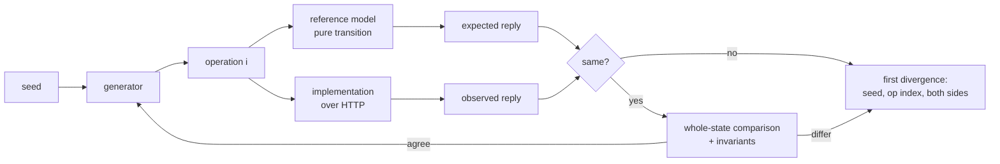

# Verification in depth

What each verification layer is for, what it cannot see, and the exact formats it
writes. The toolkit is in `commit/`; the problem-specific layers used for calibration
are in `calibration/verification/`.

## Why layers, and why measure them

A green suite says only that the checks someone wrote passed. Each layer below catches a
class of defect the others are weak at, and the mutation campaign then measures the whole
stack against seeded defects, so its strength is a number with a reproduction command
rather than a feeling.

| Layer | Catches | Blind to |
|---|---|---|
| Supplied checks | wiring, the obvious path of each surface | everything the task's authors held back |
| Contract checks | every stated rule, both sides of every boundary, error precedence | interactions between operations |
| Reference model | divergence from the specification over long generated sequences | rules the model does not encode; concurrency |
| Adversarial campaigns | races, lost responses, retries, exhaustion | single-request rule violations |
| Clean / offline run | hidden network, host or build-cache dependencies | behaviour |
| Mutation campaign | *the weakness of all of the above* | design-level omissions (missing features) |

## Contract checks

One assertion per rule in the specification, each tagged with its section. They are
written from the text of the specification, deliberately including the cases sample
tests tend to skip: the value one past each limit **and** the limit itself, every
wrong-type case, error precedence (a claimed idempotency key resolves before field
validation), and "no trace" checks that compare state before and after a refused write.

## Reference-model campaigns (`commit/campaign.ts`)



A campaign module provides `setup`, `generate`, `step` (the model), `execute`, `mismatch`,
optionally `bind` (to learn identifiers the implementation chose), and `compareState`.
The runner owns the seeded RNG, the lockstep loop, first-divergence detection and the
report.

The model is deliberately smaller than the implementation: in the calibration campaign,
wallets are integers, requests are four-state records, idempotency is a map from
(user, path, key) to the first successful reply. It shares no code with the service; it
derives handles and equal-split shares by different algorithms than the service uses, so
an arithmetic defect has to be written twice, independently, to go unseen.

Generated operations are mostly valid, with adversarial variants mixed in: amounts at and
one past the balance, invalid amounts, self-targets, unknown targets, wrong-party
actions, replays of earlier operations with the same key and body, the same key with a
changed body, and signups whose derived handle collides. The report's `outcomes` table
shows the mix actually exercised, so a generator that only produces refusals is visible.

**Report** (`reference-report.json` / `.md`): seed, operations requested and executed,
whole-state comparisons, invariant checks, outcome mix, duration, result, the initial
fixture, the first divergence (operation index, operation, expected, observed) and the
full operation sequence. Reproduce with the recorded command; the seed fixes everything.

## Adversarial campaigns

Each campaign states the property it attacks and judges **persistent state** afterwards —
balances, request status, the feed — not only the status codes the burst returned. Every
campaign runs `--rounds` times with different seeds.

| Campaign | Property |
|---|---|
| same-key-storm | N concurrent identical requests under one unused key: one 201, the rest 200 with an identical body, one effect |
| same-key-different-bodies | concurrent requests sharing a key but not a body: one effect, the rest 409 reuse or identical replays |
| drain-race | concurrent payments whose sum exceeds the wallet: accepted ones never overdraw, refusals move nothing |
| fan-in | many senders to one recipient: the recipient gains exactly the accepted total |
| ring | payments around a cycle in both directions: conservation, no negative wallet |
| request-double-pay | one request paid concurrently under different keys: money moves once |
| pay-versus-cancel | pay and cancel race: the request ends paid xor cancelled, money matches |
| settlement-under-drain | a batch races payments draining its senders: all-or-nothing |
| lost-response-retry | the client abandons a request mid-flight and retries with the same key: one effect |
| signup-race | concurrent signups for one email: exactly one account, the rest 409 email_taken |
| mixed-garbage | valid, invalid, malformed and unauthenticated writes together: no 5xx, no partial effect |

## Mutation campaigns (`commit/mutate.ts`)

### Operators

Applied only to executable code: TypeScript is first reduced to JavaScript by Node's own
type stripper (which blanks type syntax and keeps every offset), then a small lexer masks
strings, comments, template text and regex literals.

| Operator | Example | Models |
|---|---|---|
| `boundary` | `<` → `<=` | off-by-one in a limit or a funds check |
| `equality-negation` | `===` → `!==` | inverted condition |
| `logical` | `&&` → `\|\|` | wrong combination of conditions |
| `arithmetic` | `a - b` → `a + b` | wrong sign in a money movement |
| `compound-assignment` | `-=` → `+=` | debit applied as credit |
| `boolean-literal` | `true` → `false` | wrong default |
| `negation-removal` | `!x` → `x` | missing negation |
| `rounding` | `Math.floor` → `Math.ceil` | rounding direction |
| `literal-boundary` | `200` → `201` | wrong constant / limit |
| `guard-bypass` | `if (cond)` → `if (false)` | validation or authorisation check skipped |
| `statement-deletion` | `x.balance -= a;` → `;` | dropped state update — half of an atomic step |

### Classification

| Outcome | Meaning | Counted |
|---|---|---|
| killed | the check failed against the mutant | valid; numerator |
| survived | the check passed — the suite accepted bad work | valid |
| timeout | the check hung past its limit | valid; reported separately |
| invalid | the mutant never became healthy (it cannot be deployed at all) | excluded, listed |
| error | the check command itself could not run | excluded; **the campaign is marked broken and exits non-zero** |
| equivalent | a reviewer judged it unobservable under the specification | excluded, listed with the reason |

`killRate = killed / (killed + survived + timeout)`. `detectionRate` additionally counts
timeouts as detected. The unmutated baseline must pass the check before any mutant runs,
or the campaign aborts and reports no score.

### Layer attribution

The check may print `COMMIT-LAYER <name>=<pass|fail>` lines; the runner records them per
mutant and reports, for each layer, how many mutants it killed and how many it killed
**alone** — defects every other layer would have accepted.

### Isolation

Each mutant is evaluated in its own temporary copy of the candidate, started on its own
free port, and deleted afterwards. The candidate itself is never written.

## The evidence record (`commit/verify.ts`)

```text
evidence/<run>/
  evidence.json      the manifest: stage, specification, revision (commit, dirty flag,
                     tree digest before and after), environment, every step (command,
                     status, exit code, duration, log path + sha256), report summaries,
                     verdict, production modification by verifier
  evidence.sha256    sha256 of evidence.json: an integrity identifier, not a proof
  verdict.md         the REJECT / ACCEPT / INCONCLUSIVE block and the step table
  scorecard.md       the factory scorecard, filled only with numbers this run produced
  reproduction.sh    checks out the revision and re-runs the plan
  logs/<step>.log    full output of every step
  <step>/            reports written by individual layers
```

A plan is JSON: the stage, the target folder, the specification reference, how to start
the service, and steps with `id`, `kind`, `cmd`, `blocking`, optional `requirements`
(ids from the planner's list), `environment` (a precondition whose failure means
*environment*, not *implementation*), `needsService` and `report`.
